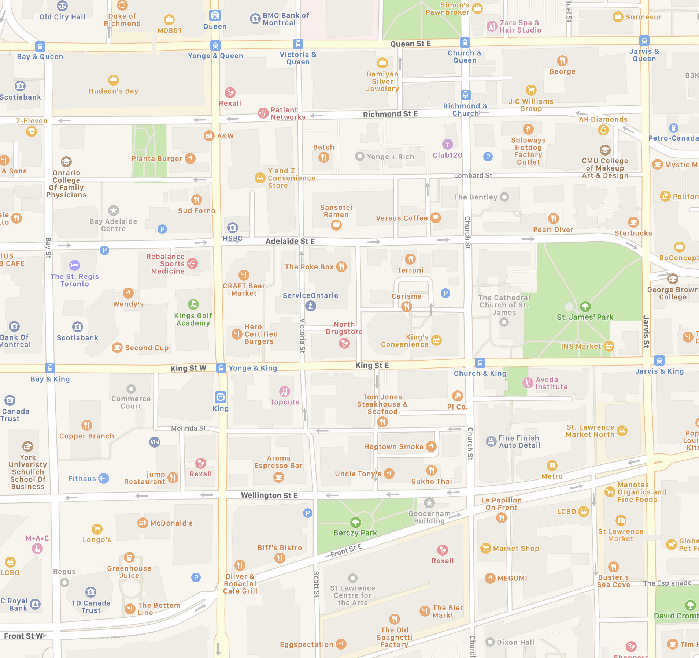
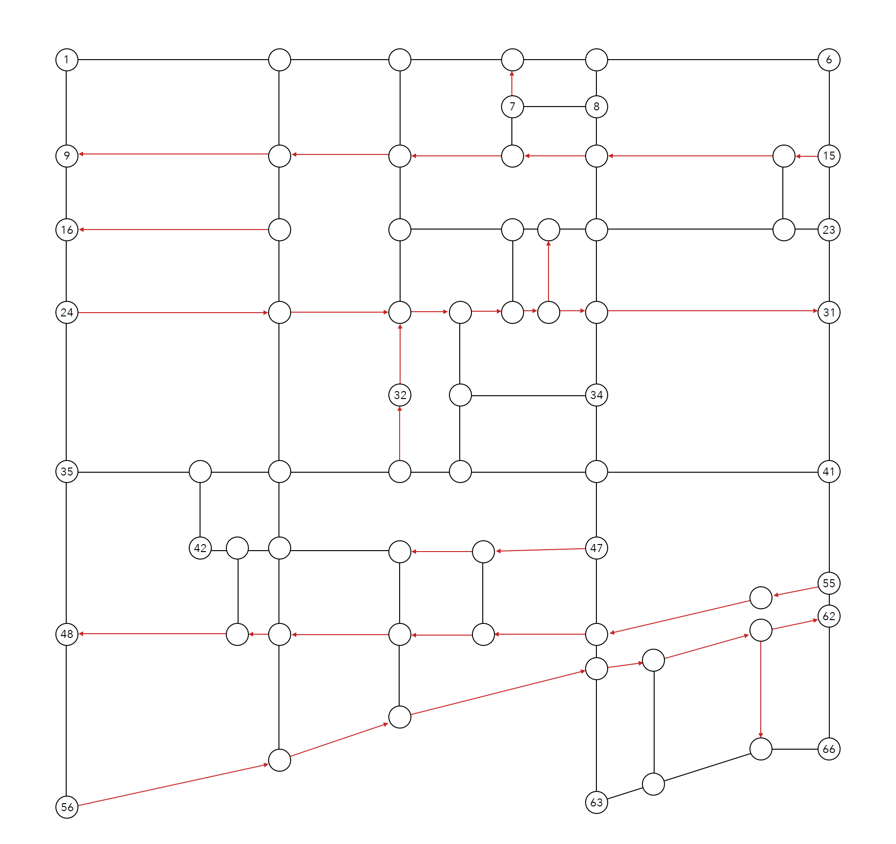

# graph-map-demo

This demo of pathfinding with graphs represents a real-world city block as a graph and provides efficient directions through the city, taking into account one-way streets, using a modified breadth-first search.

A chunk of downtown Toronto appears like this on mapping applications:

But can be understood as a directed graph in this way, with vertices representing intersections and edges representing streets:

By representing a real-world map as a graph, common graph algorithms can be used to determine efficient routes between any two destinations on the map.

For example:

- The most efficient route from Yonge and Queen (node 2) to Jarvis and King (node 41) is `2, 3, 4, 5, 6, 15, 23, 31, 41`.
- The most efficient route from Church and King (node 40) to Adelaide and Victoria (node 26) is `40, 39, 38, 32, 26`.
